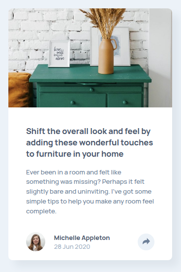
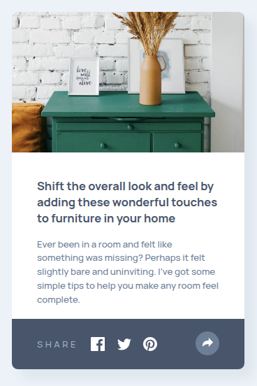
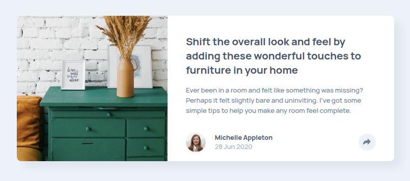
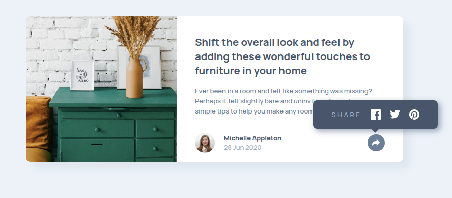

# Frontend Mentor - Article preview component solution

This is a solution to the [Article preview component challenge on Frontend Mentor](https://www.frontendmentor.io/challenges/article-preview-component-dYBN_pYFT). Frontend Mentor challenges help you improve your coding skills by building realistic projects.

## Table of contents

- [Overview](#overview)
  - [The challenge](#the-challenge)
  - [Screenshot](#screenshot)
  - [Links](#links)
- [My process](#my-process)
  - [Built with](#built-with)
  - [What I learned](#what-i-learned)
- [Author](#author)

## Overview

### The challenge

Users should be able to:

- View the optimal layout for the component depending on their device's screen size
- See the social media share links when they click the share icon

### Screenshot

--- Small Screens ---

--- Small Screens Active State ---

--- Larger Screens ---

--- Larger Screens Active State ---

### Links

- Solution URL: [Repository](https://github.com/amShuri/article-preview-component)
- Live Site URL: [Live Site](https://amshuri.github.io/article-preview-component/)

## My process

### Built with

- Semantic HTML5 markup
- CSS custom properties
- Flexbox
- CSS Grid
- Mobile-first workflow

### What I learned

I learned that you can have buttons with no text (and use them as "icons") as long as you add the proper aria attribute to it. I also learned that sometimes it's better to simply use an anchor with an img element inside instead of a button, but, I learned this when I had already finished the challenge so I'm going to put this into practice another time.

## Author

- GitHub - [amShuri](https://github.com/amShuri/)
- Frontend Mentor - [@amShuri](https://www.frontendmentor.io/profile/amShuri)
- Twitter - [@amShuri7](https://x.com/amshuri7)
